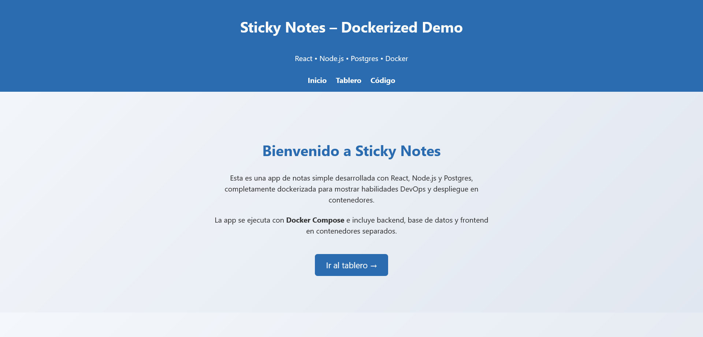
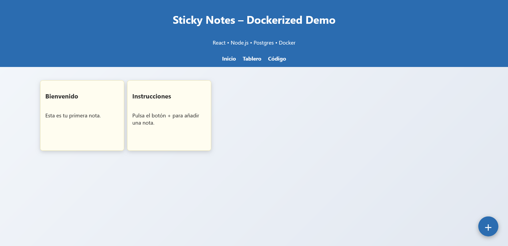

# Sticky Notes – Dockerized Full-Stack App

A simple yet modern notes application, designed to showcase a **fully dockerized Full-Stack flow (React + Node.js + Postgres)**, with separate environments for development and production.

<div style="display: flex; gap: 20px; align-items: flex-start;">

    
</div>

---

## Features

- **Frontend:** React with React Router, clean SaaS-style design.
- **Backend:** Node.js + Express + Postgres (real persistence).
- **Database:** PostgreSQL 15 with automatic initialization.
- **Separate containers** for frontend, backend, and DB.
- **Optimized for CI/CD and container deployment.**
- **Ready-to-use environments:** Development (hot reload) and Production (Nginx with cache and gzip).

---

## Technologies Used
- React + React Router (Frontend)
- Node.js + Express (API)
- PostgreSQL 15 (DB)
- Docker & Docker Compose (Orchestration)
- Nginx (Optimized server in production)

---

## How to Run the Project

### Development (with hot reload)
```bash
docker compose -f docker-compose.yml -f docker-compose.override.yml up
```
Access at [http://localhost:3000](http://localhost:3000)

### Production (optimized build)
```bash
docker compose -f docker-compose.yml -f docker-compose.prod.yml up --build -d
```
Access at [http://localhost](http://localhost)

<div align="center">
    
</div>

---

---

## Structure
```
.
├── frontend/    # React app (Landing + Board)
├── backend/     # Express API with Postgres
├── docker-compose.yml          # Base config
├── docker-compose.override.yml # Development environment
├── docker-compose.prod.yml     # Production environment
└── README.md
```

## License

Licensed under the **MIT License**.  
See [LICENSE](LICENSE) for more details.

---

## Author

**Celia Rico Gutiérrez**  
DevOps Engineer — CI/CD automation, modularization, reproducible packaging 

[](https://www.linkedin.com/in/celiaricogutierrez)
[](https://www.malt.es/profile/celiaricogutierrez)
[](https://www.upwork.com/freelancers/~01898dfb872ff48b7a?mp_source=share)

---

_\~Last updated: August 2025\~_

