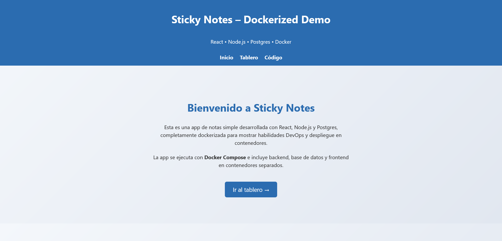
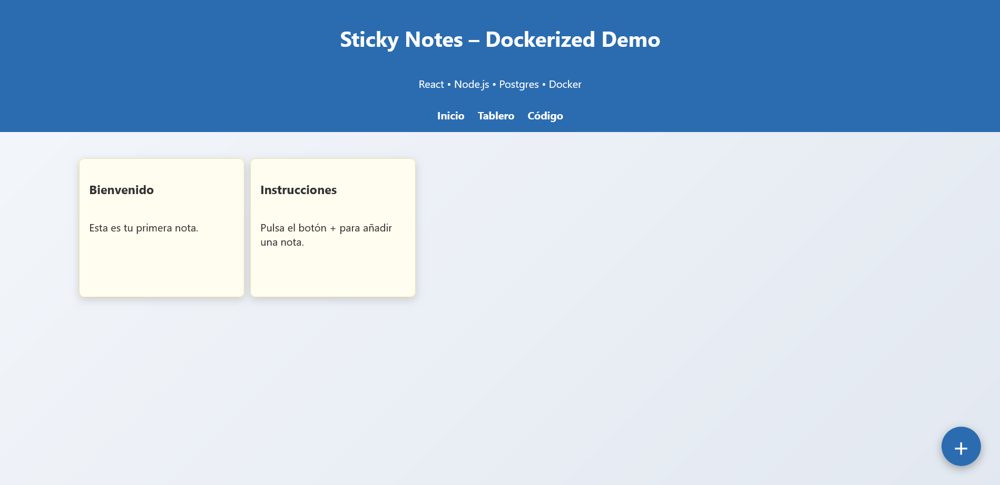
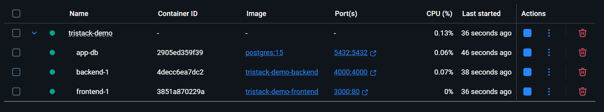

# Sticky Notes – Dockerized Full-Stack App

Una aplicación de notas simple pero moderna, diseñada para demostrar un flujo **Full-Stack (React + Node.js + Postgres)** totalmente **dockerizado**, con entornos diferenciados para desarrollo y producción.

<div style="display: flex; gap: 20px; align-items: flex-start;">

    
</div>


---

## Características

- **Frontend:** React con React Router, diseño limpio estilo SaaS.
- **Backend:** Node.js + Express + Postgres (persistencia real).
- **Base de datos:** PostgreSQL 15 con inicialización automática.
- **Contenedores separados** para frontend, backend y DB.
- **Optimizado para CI/CD y despliegue en contenedores.**
- **Entornos listos:** Desarrollo (hot reload) y Producción (Nginx con cache y gzip).

---

## Tecnologías usadas
- React + React Router (Frontend)
- Node.js + Express (API)
- PostgreSQL 15 (DB)
- Docker & Docker Compose (Orquestación)
- Nginx (Servidor optimizado en producción)

---

## Cómo levantar el proyecto

### Desarrollo (con hot reload)
```bash
docker compose -f docker-compose.yml -f docker-compose.override.yml up
```
Accede en [http://localhost:3000](http://localhost:3000)

### Producción (build optimizado)
```bash
docker compose -f docker-compose.yml -f docker-compose.prod.yml up --build -d
```
Accede en [http://localhost](http://localhost)

<div align="center">
    
</div>

---
---

## Estructura
```
.
├── frontend/    # React app (Landing + Tablero)
├── backend/     # API Express con Postgres
├── docker-compose.yml          # Config base
├── docker-compose.override.yml # Entorno desarrollo
├── docker-compose.prod.yml     # Entorno producción
└── README.md
```

## Licencia

Licenciado bajo la **Licencia MIT**.  
Consulta [LICENSE](LICENSE) para más detalles.

---

## Autora

**Celia Rico Gutiérrez**  
Ingeniera DevOps — Automatización CI/CD, modularización, empaquetado reproducible  

[](https://www.linkedin.com/in/celiaricogutierrez)
[](https://www.malt.es/profile/celiaricogutierrez)
[](https://www.upwork.com/freelancers/~01898dfb872ff48b7a?mp_source=share)

---

_~Última actualización: agosto de 2025~_
